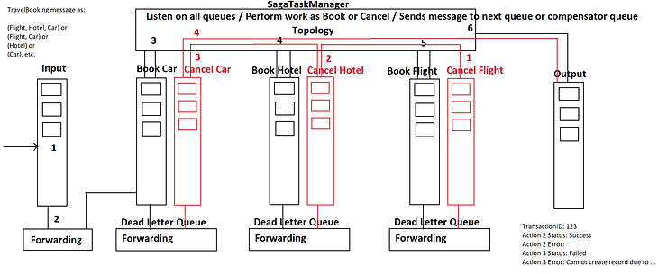

# Distributed transactions in Azure Cloud

## Project's description

This article details implementing a framework to commit or roll back **distributed transactions** in a disconnected architecture involving **Azure Functions** and **Azure Service Bus.**.

## Online article
Details about this project can be read in my blog's articles here: 

[Article 1](https://www.ideliversoft.com/post/distributed-transactions-in-the-cloud-part-i)

[Article 2](https://www.ideliversoft.com/post/distributed-transactions-in-the-cloud-part-ii)

## Context
I have done this work in 2023. The main technologies used were: **.NET Core**, **Azure Service Bus**, **Azure Event Hub**, **Azure Durable Functions**, and **Azure**.
